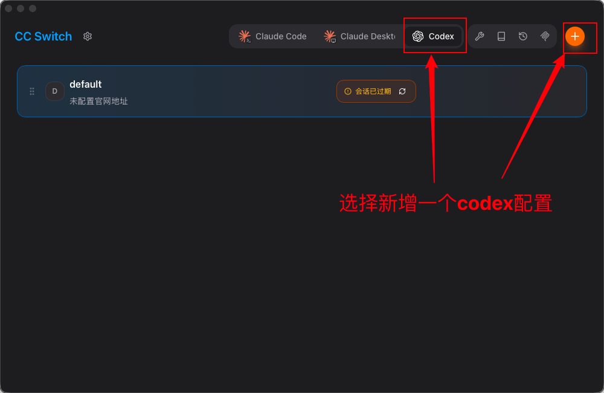
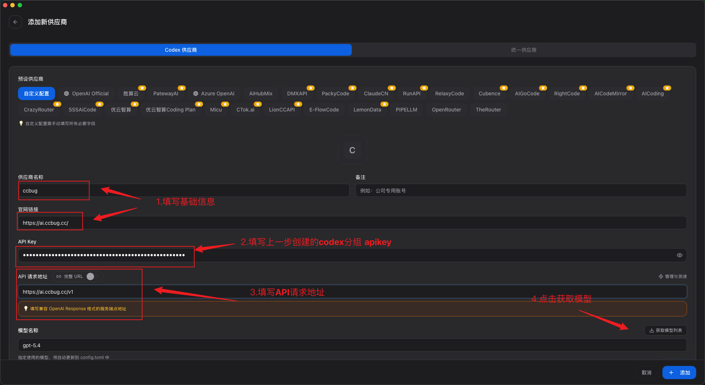
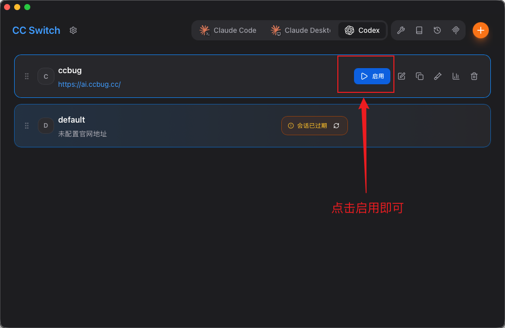

# Codex Config

This page explains how to add and enable the `ccbug` configuration for Codex CLI in CC Switch.

::: warning Note
Keys from the Codex group can only request OpenAI / GPT-related models. Keys from the Claude Code group can only request Claude-related models. Do not mix them.
:::

## Add A Codex Configuration

Open CC Switch, switch to `Codex`, then click the plus button in the upper-right corner to add a Codex configuration.

## Fill In Configuration Parameters

Use the following values:

| Field | Value |
| --- | --- |
| Provider name | `ccbug` |
| Official URL | `https://ai.ccbug.cc/` |
| API Key | The Codex group API Key you created, for example `sk-xxxx` |
| API request URL | `https://ai.ccbug.cc/v1` |
| Model name | Click "Get model list", then choose the GPT / OpenAI model you need |

## Enable The Codex Configuration

Close Codex CLI before switching configurations. After saving, find `ccbug` in the Codex list in CC Switch and click "Enable".

