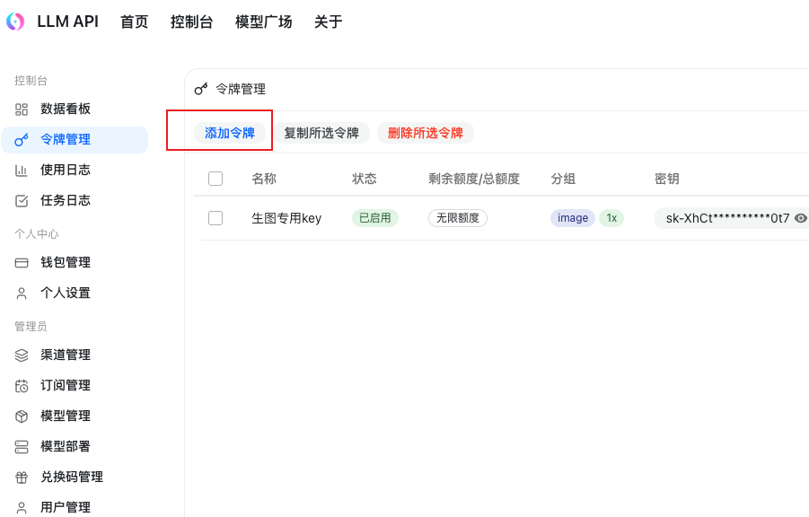

# Create API Key

API Keys are created in the LLM API console. Keys created under different groups can only be used with the matching model family, so confirm whether you are configuring Codex CLI or Claude Code first.

## Open Token Management

Open the LLM API console, choose "Token Management" on the left, then click "Add Token".

## Choose A Token Group

Pay attention to the token group when creating a token:

- `Codex`: for GPT / OpenAI-related models.
- Groups starting with `Claude Code`: for Claude-related models.
- `Gemini`: for Gemini CLI-related models.

## Create A Codex Group Key

For Codex, use any meaningful name such as `codex dedicated group`; choose the Codex group; set the expiration to "Never expires" if needed; keep the quantity as `1`; then submit.

You now have a Codex (GPT) group key.

## Create A Claude Code Group Key

Token groups starting with Claude Code can only be used with Claude-related models, such as `opus4.6` and `sonnet4.6`.

You can name it `Claude Code dedicated KEY`, choose a Claude Code group, set the expiration to "Never expires" if needed, then click "Submit".

## Next Step

To configure Codex CLI, continue to [Codex Config](./codex-config.md).

To configure Claude Code, continue to [Claude Code Config](./claude-code-config.md).
