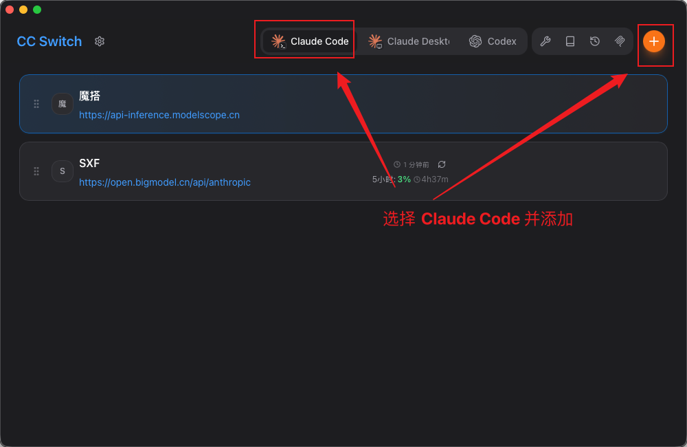
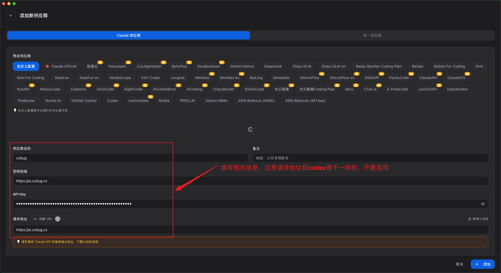
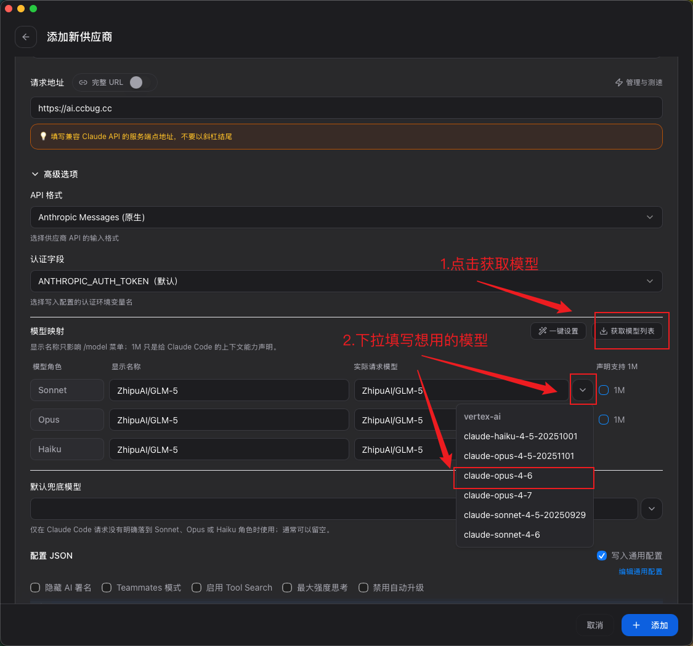
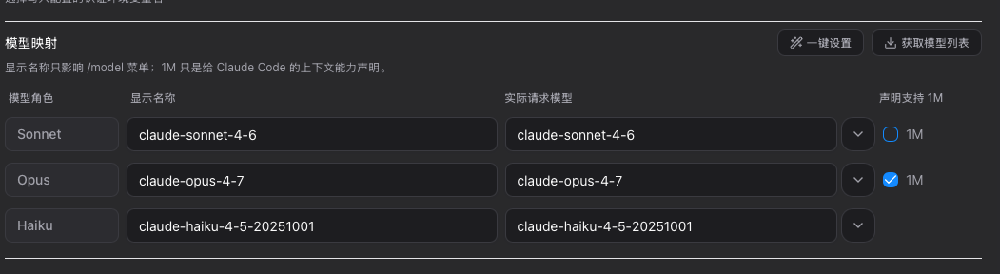
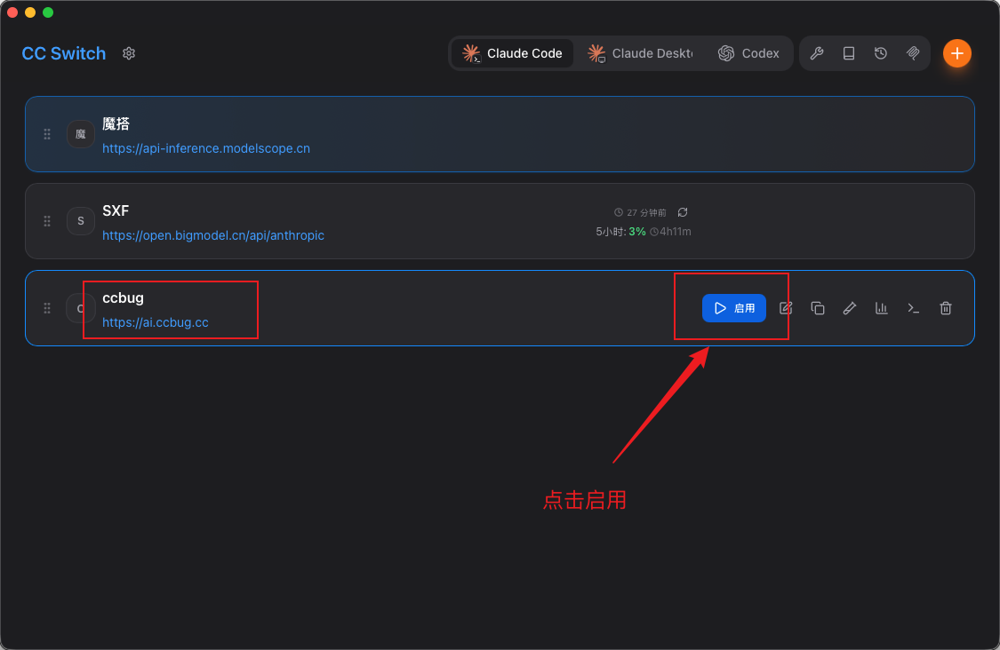

# Claude Code 配置

本文介绍如何在 CC Switch 中添加并启用 Claude Code 的 `ccbug` 配置。

::: warning 注意
Claude Code 的请求地址和 Codex 不一样。Claude Code 使用 `https://ai.ccbug.cc`，Codex 使用 `https://ai.ccbug.cc/v1`，不要混用。
:::

## 新增 Claude Code 配置

打开 CC Switch，选择 `Claude Code`，点击右上角加号新增配置。

## 填写 Claude Code 配置

按下列信息填写：

| 配置项 | 填写内容 |
| --- | --- |
| 供应商名称 | `ccbug` |
| 官网链接 | `https://ai.ccbug.cc` |
| API Key | 创建的 Claude Code 分组 API Key，例如 `sk-xxxx` |
| 请求地址 | `https://ai.ccbug.cc` |

## 配置模型

点击「获取模型列表」，然后在模型映射中下拉选择想使用的模型。

参考配置如下：

| 模型角色 | 显示名称 | 实际请求模型 |
| --- | --- | --- |
| Sonnet | `claude-sonnet-4-6` | `claude-sonnet-4-6` |
| Opus | `claude-opus-4-7` | `claude-opus-4-7` |
| Haiku | `claude-haiku-4-5-20251001` | `claude-haiku-4-5-20251001` |

## 启用 Claude Code 配置

配置保存后，在 CC Switch 的 Claude Code 列表中找到 `ccbug`，点击「启用」。

