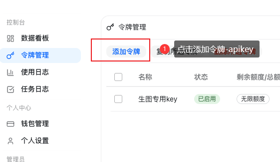
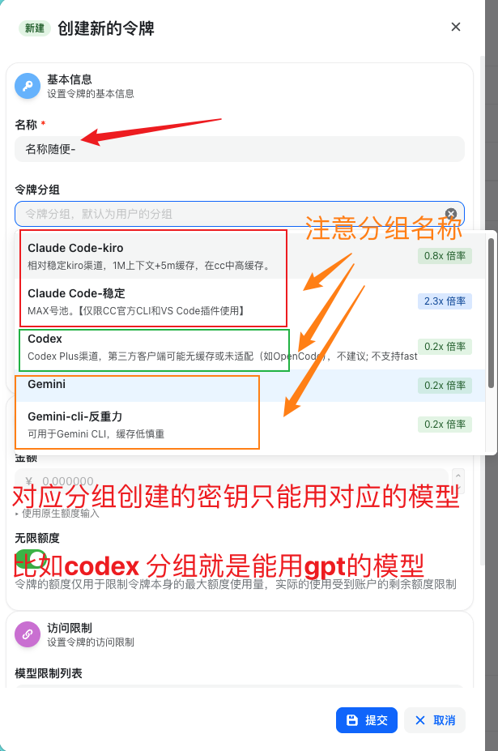
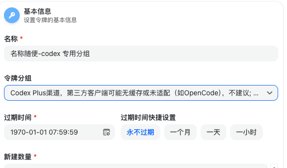
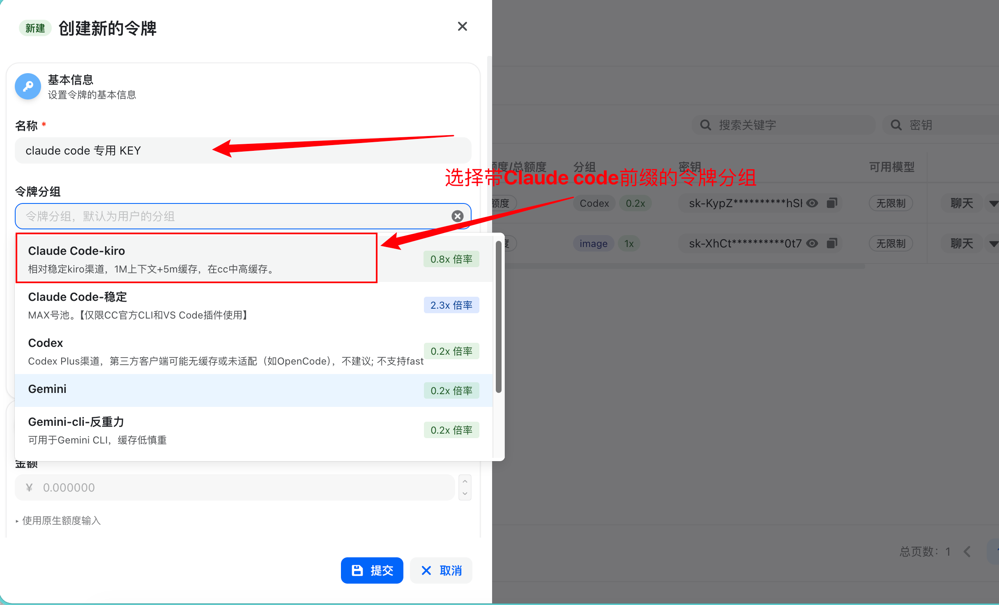
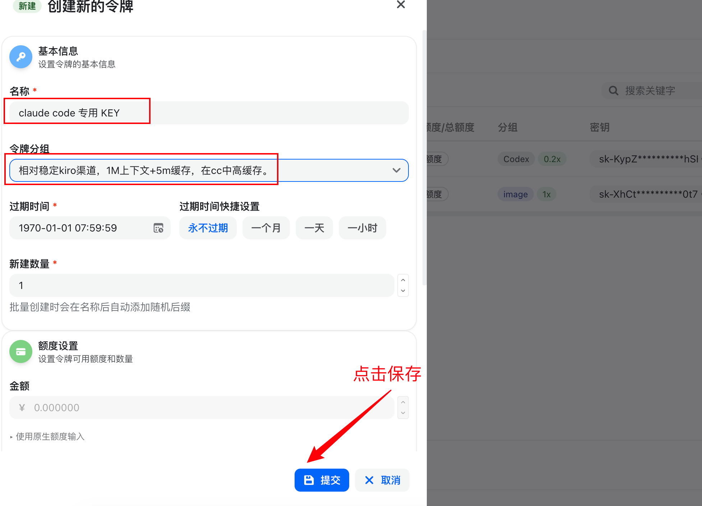

# 创建 API Key

API Key 需要在 LLM API 控制台中创建。不同分组创建出来的 Key 只能用于对应模型，请先确认要配置的是 Codex CLI 还是 Claude Code。

## 进入令牌管理

进入 LLM API 控制台，在左侧选择「令牌管理」，点击「添加令牌」。

## 选择令牌分组

创建令牌时需要注意「令牌分组」：

- `Codex` 分组：用于 GPT / OpenAI 相关模型。
- `Claude Code` 开头的分组：用于 Claude 相关模型。
- `Gemini` 分组：用于 Gemini CLI 相关模型。

## 创建 Codex 分组 Key

以 Codex 为例，名称可以按用途填写，例如 `名称随便-codex 专用分组`；令牌分组选择 Codex 分组；过期时间可选择「永不过期」；新建数量保持 `1`，然后提交。

到这里就创建好了一个 Codex（GPT）分组密钥。

## 创建 Claude Code 分组 Key

Claude Code 开头的令牌分组只能用于 Claude 相关模型，例如 `opus4.6`、`sonnet4.6` 等。

名称可以填写为 `claude code 专用 KEY`，令牌分组选择 Claude Code 开头的分组，过期时间可选择「永不过期」，然后点击「提交」。

## 下一步

如果要配置 Codex CLI，继续阅读：[Codex 配置](./codex-config.md)

如果要配置 Claude Code，继续阅读：[Claude Code 配置](./claude-code-config.md)
