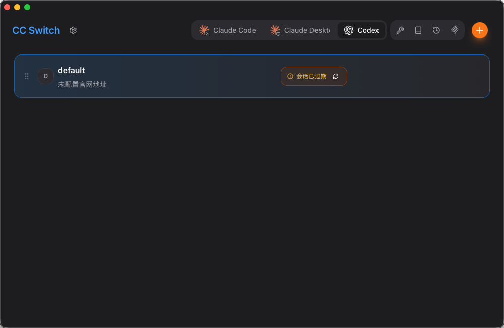

# 安装 CC Switch

CC Switch 用于统一管理 Claude Code、Codex CLI 等工具的代理配置。本文先介绍下载安装到初始配置检查的步骤。

## 下载地址

前往 [farion1231/cc-switch Releases](https://github.com/farion1231/cc-switch/releases) 下载并安装 CC Switch。

## 检查默认配置

安装 CC Switch 之前，如果已经用过 Codex 或 Claude Code，软件会自动扫描已有配置。

下图中的 `default` 是自动扫描出来的默认配置。如果之前登录过 Codex 官方账号，请不要删除、不要编辑这个默认配置。

## 下一步

安装完成后，继续创建可用于 Codex CLI 或 Claude Code 的 API Key。

继续阅读：[创建 API Key](./create-api-key.md)
